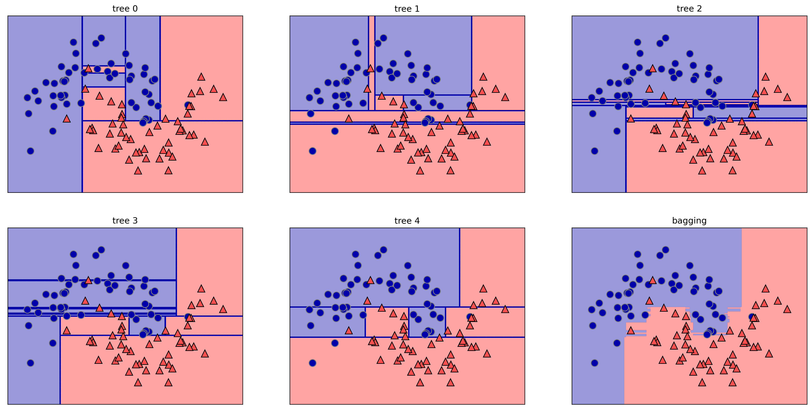
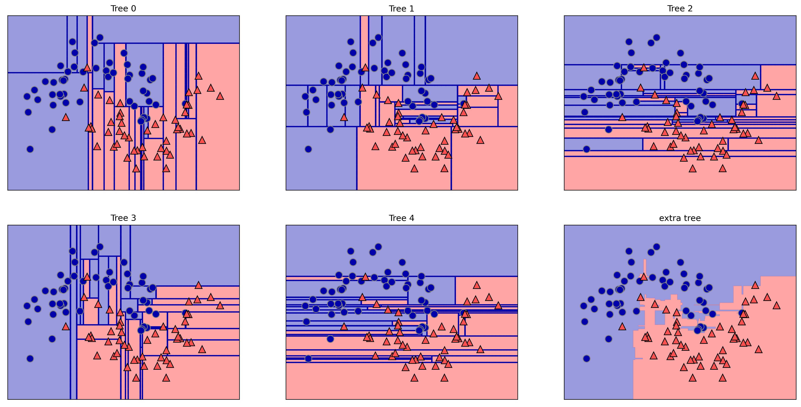
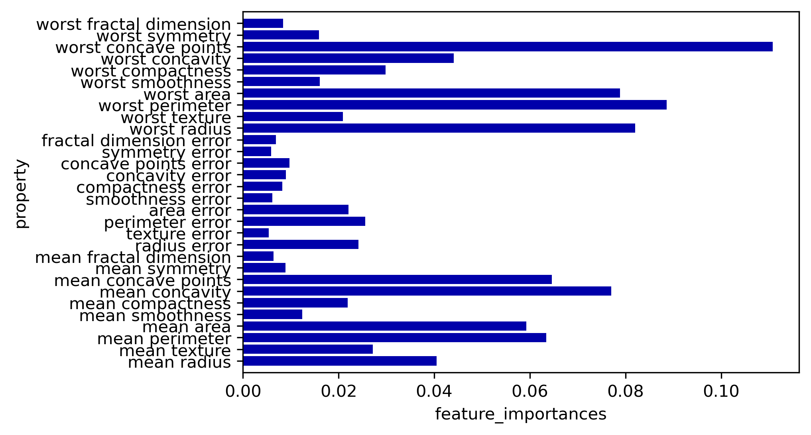
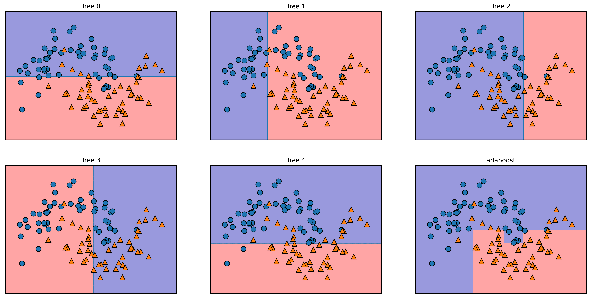

```python
import mglearn
import numpy as np
import os
import sys
sys.path.append(os.path.dirname(os.path.abspath(os.path.dirname('__file__'))))
import matplotlib.pyplot as plt
from sklearn.model_selection import train_test_split
from sklearn.datasets import make_moons
from sklearn.datasets import load_breast_cancer

from sklearn.linear_model import LogisticRegression
from sklearn.ensemble import BaggingClassifier
from sklearn.ensemble import ExtraTreesClassifier
from sklearn.ensemble import AdaBoostClassifier
```


```python
# 예제 데이터셋 생성

Xm, ym = make_moons(n_samples = 100, noise = 0.25, random_state = 3)
Xm_train, Xm_test, ym_train, ym_test = train_test_split(Xm, ym, stratify = ym, random_state = 42)

cancer = load_breast_cancer()
Xc_train, Xc_test, yc_train, yc_test = train_test_split(cancer.data, cancer.target, random_state = 0)
```


---

#### <u>배깅(Bagging)</u>

- `Bootstrap aggregating`의 준말
- 중복을 허용한 랜덤 샘플링으로 만든 훈련 세트를 사용하여 분류기를 각기 다르게 학습시킨다.
    - `부트스트립 샘플`을 만드는 것은 `랜덤 포레스트`의 특징과 동일하다
- `predict_proba()`
    - 해당 매서드를 분류기가 지원 => 확률값을 평균하여 예측 수행
    - 해당 매서드를 분류기가 미지원 => 가장 빈도가 높은 클래스 레이블이 예측 결과가 된다.
    
<br>

`배깅`을 사용하여 `cancer 데이터셋`에 [`로지스틱 회귀`](https://jhryu1208.github.io/data/2020/11/13/ML_classification_linear_regression/) 모델을 100개 훈련시켜 앙상블을 진행해보자.<br>
기본 설정은 다음과 같다.

- `LogisticRegression`객체를 기반 분류기로 설정
- `n_estimators = 100` : 훈련시킬 분류기의 개수는 100개
- `oob_score = True` : 부트스트래핑에 포함되지 않은 샘플을 기반으로 훈련된 모델을 평가<br>(`RandomForestClassifier`도 해당 매개변수 지원, 따로 설정하지 않을시 default값은 False이다.)


```python
bagging = BaggingClassifier(LogisticRegression(), n_estimators = 100, 
                            oob_score = True, n_jobs = -1, random_state=42)
bagging.fit(Xc_train, yc_train)
```


    BaggingClassifier(base_estimator=LogisticRegression(), n_estimators=100,
                      n_jobs=-1, oob_score=True, random_state=42)


```python
print("훈련 세트 정확도 : {:.3f}".format(bagging.score(Xc_train, yc_train)))
print("테스트 세트 정확도 : {:.3f}".format(bagging.score(Xc_test, yc_test)))
print("OOB 샘플의 세트 정확도 : {:.3f}".format(bagging.oob_score_))
```

    훈련 세트 정확도 : 0.955
    테스트 세트 정확도 : 0.937
    OOB 샘플의 세트 정확도 : 0.944
    

<br>

다음으로<br>`랜덤 포레스트`를 사용하면 더 편하지만, 학습을 위해 결정 트리로 배깅을 수행하고 시각화까지 진행할 것이다.<br>(더 편한 이유는 데이터를 샘플링하고 결정 트리 모델을 여러개 만드는데 이미 각기 다른 알고리즘이 2개 포함된다.<br>하지만 `랜덤 포레스트`는 하나의 알고리즘으로 둘 다 수행할 수 있다.) 

<br>


```python
# 결정트리 + 배깅 모델 제시

from sklearn.tree import DecisionTreeClassifier
bagging = BaggingClassifier(DecisionTreeClassifier(), n_estimators = 5,
                            n_jobs = -1, random_state = 42)

bagging.fit(Xm_train, ym_train)
```


    BaggingClassifier(base_estimator=DecisionTreeClassifier(), n_estimators=5,
                      n_jobs=-1, random_state=42)


```python
# 결정트리 + 배깅 시각화

fig, axes = plt.subplots(2, 3, figsize = (20, 10))
for i, (ax, tree) in enumerate(zip(axes.ravel(), bagging.estimators_)):
    ax.set_title('tree {}'.format(i))
    mglearn.plots.plot_tree_partition(Xm, ym, tree, ax=ax)

mglearn.plots.plot_2d_separator(bagging, Xm, fill=True, ax=axes[-1, -1], alpha = .4)
axes[-1, -1].set_title('bagging')
mglearn.discrete_scatter(Xm[:, 0], Xm[:, 1], ym)
plt.show()
```





이전 포스팅의 [랜덤 포레스트](https://jhryu1208.github.io/data/2020/11/16/ML_decision_tree_ensemble_random_forest/)의 결정 경계와 매우 비슷한 것을 확인할 수 있다.

<br>

이번에는 `n_estimators = 100`으로 늘려서 `cancer 데이터셋`에 훈련시켜보고 `훈련 세트`와 `테스트 세트`의 성능을 확인해보면 다음과 같다.


```python
bagging = BaggingClassifier(DecisionTreeClassifier(), n_estimators = 100,
                            oob_score = True, n_jobs = -1, random_state = 42)

bagging.fit(Xc_train, yc_train)
```


    BaggingClassifier(base_estimator=DecisionTreeClassifier(), n_estimators=100,
                      n_jobs=-1, oob_score=True, random_state=42)


```python
print("훈련 세트 정확도 : {:.3f}".format(bagging.score(Xc_train, yc_train)))
print("테스트 세트 정확도 : {:.3f}".format(bagging.score(Xc_test, yc_test)))
print("OOB 샘플의 세트 정확도 : {:.3f}".format(bagging.oob_score_))
```

    훈련 세트 정확도 : 1.000
    테스트 세트 정확도 : 0.965
    OOB 샘플의 세트 정확도 : 0.948
    

<br>

`배깅`과 `랜덤 포레스트`의 별거 아닌거 같은 차이점은 간단하게 다음과 같다.

- `배깅`
    - `max_samples`매개변수에서 부트스트랩 샘플의 크기를 지정
    - `결정 트리`를 `splitter = 'random'`으로 설정하면<br>무작위로 분할한 후보 노드 중 최선의 분할을 찾는다.

- `랜덤 포레스트`
    - `max_feature`매개변수에서 부트스트랩 샘플의 크기를 지정
    - `DecisionTreeClassifier(splitter = 'best')`로 고정되어있다.

<br>

다음에 살펴볼 `엑스트라 트리`는 이런 `결정 트리의 배깅 앙상블`과 관련이 많다.

<br>

---

#### <u>엑스트라 트리(Extra-Tree)</u>

- `랜덤 포레스트`와 비슷하지만 후보 특성을 <u>무작위로 <b>분할</b>한 다음 <b>최적의 분할</b>을 찾는다.</u>
    - 랜덤 포레스트 : 알고리즘이 각 노드에서 후보 특성을 랜덤하게 <b>선택</b>한 후 <b>이 후보들 중에서 최선의 테스트</b>를 찾는다
-  `랜덤 포레스트`와 달리 <u>`DecisionTreeClassifier(splitter = 'random')`을 사용하고 `부트스트랩 샘플링`은 적용하지 않는다.</u>
    - `랜덤 포레스트`와 `엑스트라 트리`는 (쉽게 말해서 결국엔) 서로 다른 방식으로 모델에 <b>무작위성</b>을 주입한다고 볼 수 있다.
    - 무작위성을 증가시키면 일반적으로 모델의 `bias`는 늘어나지만 `variance`는 감소한다.
- <u>예측 방식은 `랜덤 포레스트`와 동일하게 트리가 만든 확률값을 평균한다.</u>

<br>

two_moons 데이터셋에 `엑스트라 트리`를 적용하여 결정 경계를 확인해보자.<br>


```python
xtree = ExtraTreesClassifier(n_estimators =5, n_jobs = -1, random_state = 0)
# 참고로 n_jobs = -1로 지정할 경우 pc의 모든 코어를 사용하게 됩니다.
xtree.fit(Xm_train, ym_train)
```


    ExtraTreesClassifier(n_estimators=5, n_jobs=-1, random_state=0)


```python
fig, axes = plt.subplots(2, 3, figsize = (20, 10))
for i, (ax, tree) in enumerate(zip(axes.ravel(), xtree.estimators_)):
    ax.set_title("Tree {}".format(i))
    mglearn.plots.plot_tree_partition(Xm, ym, tree, ax = ax)

mglearn.plots.plot_2d_separator(xtree, Xm, fill = True, ax = axes[-1, -1], alpha = .4)
axes[-1, -1].set_title('extra tree')
mglearn.discrete_scatter(Xm[:, 0], Xm[:, 1], ym)
plt.show()
```





결과를 통해 다음을 알 수 있다.
- 후보 노드를 랜덤하게 분할한 다음 최선의 분할을 찾기 때문에 <u>개별 트리의 결정 경계가 더 복잡해졌다.</u>
- 개별 트리를 앙상블한 `엑스트라 트리`의 결정 경계는 <u>합치기전 개별 트리의 결정 경계보다 비교적 안정적이다.</u>

<br>

`ExtraTreesClassifier`의 트리 개수 매개변수를 100으로 지정하여 cancer 데이터셋에 적용해보자


```python
xtree = ExtraTreesClassifier(n_estimators = 100, n_jobs = -1, random_state = 0)
xtree.fit(Xc_train, yc_train)
```


    ExtraTreesClassifier(n_jobs=-1, random_state=0)


```python
print("훈련 세트 정확도 : {:.3f}".format(xtree.score(Xc_train, yc_train)))
print("테스트 세트 정확도 : {:.3f}".format(xtree.score(Xc_test, yc_test)))
```

    훈련 세트 정확도 : 1.000
    테스트 세트 정확도 : 0.972
    

해당 예제에서 `엑스트라 트리`는 `랜덤 포레스트`와 거의 같은 성능을 낸 것을 확인할 수 있다.
- [저번 포스팅](https://jhryu1208.github.io/data/2020/11/16/ML_decision_tree_ensemble_random_forest/)에서 `랜덤 포레스트`의 성능은 다음과 같았다 : 훈련 세트 정확도: 1.000, 테스트 세트 정확도: 0.972

<br>

`엑스트라 트리`의 특성 중요도를 시각화하면 다음과 같다.


```python
n_features = cancer.data.shape[1]
plt.barh(range(n_features), xtree.feature_importances_, align='center')
plt.yticks(np.arange(n_features), cancer.feature_names)
plt.xlabel("feature_importances")
plt.ylabel("property")
plt.ylim(-1, n_features)
plt.show()
```





`엑스트라 트리`의 특성 중요도는 (완전히 일치하지는 않지만) 비교적으로 [이전 포스팅](https://jhryu1208.github.io/data/2020/11/16/ML_decision_tree_ensemble_random_forest/)의 `랜덤 포레스트`와 비슷한 것을 확인할 수 있다. 

<br>

---

#### <u>에이다부스트(AdaBoost)</u>

- <b>Ada</b>ptive Boosting의 준말
- `그레디언트 부스팅`처럼 `얕은 트리`와 같은 간단한 모델(`약한 학습기(weak learner)`)을 사용한다.
- 하지만, `그레디언트 부스팅`과 달리<br>이전의 모델이 `잘못 분류한 샘플`에 `가중치`를 높여서 다음 모델을 훈련시킨다.
- 훈련된 각 모델은 성능에 따라 `가중치`가 부여된다.
- 예측을 할 때는 모델이 예측한 레이블을 기준으로 모델의 `가중치를 합산`하여 `가장 높은 값을 가진 레이블`을 선택한다.


<br>

`에이다부스트`의 매개변수들은 기본적으로 다음과 같이 구성되어있다.

- `AdaBoostClassifier`
    - 기본값 : `DecisionTreeClassifier(max_dept=1)`
- `AdaBoostRegressor`
    - 기본값 : `DecisionTreeRegressor(max_dept=3)`
    - `base_estimator`매개변수에서 다른 모델을 지정할 수 있음
- `그레디언트 부스팅`과 마찬가지로 순차적으로 학습해야 하기 때문에 `n_jobs`매개변수를 지원하지 않는다.

<br>

기본값을 이용하여 two_moons데이터셋과 cancer데이터셋에 적용해보자


```python
from sklearn.ensemble import AdaBoostClassifier
ada = AdaBoostClassifier(n_estimators = 5, random_state = 42)
ada.fit(Xm_train, ym_train)
```


    AdaBoostClassifier(n_estimators=5, random_state=42)


```python
fig, axes = plt.subplots(2, 3, figsize = (20, 10))
for i, (ax, tree) in enumerate(zip(axes.ravel(), ada.estimators_)):
    ax.set_title("Tree {}".format(i))
    mglearn.plots.plot_tree_partition(Xm, ym, tree, ax = ax)

mglearn.plots.plot_2d_separator(ada, Xm, fill = True, ax = axes[-1, -1], alpha = .4)
axes[-1, -1].set_title('adaboost')
mglearn.discrete_scatter(Xm[:, 0], Xm[:, 1], ym)
plt.show()
```





`AdaBoostClassifier`는 깊이가 1인 결정 트리를 사용하기 때문에 각 트리의 결정 경계가 직선 하나로 구성된다.<br>
앙상블된 결정 경계도 다른 앙상블 모델에 비해 좀 더 단순하다.

<br>

이번에는 cancer데이터셋에 적용해보자


```python
ada = AdaBoostClassifier(n_estimators=100, random_state=42)
ada.fit(Xc_train, yc_train)
```


    AdaBoostClassifier(n_estimators=100, random_state=42)


```python
print("훈련 세트 정확도 : {:.3f}".format(ada.score(Xc_train, yc_train)))
print("테스트 세트 정확도 : {:.3f}".format(ada.score(Xc_test, yc_test)))
```

    훈련 세트 정확도 : 1.000
    테스트 세트 정확도 : 0.986
    

`아주 얕은 트리`를 앙상블 했기 때문에 다른 앙상블 모델들 보다 일반화 성능이 조금 더 향상되었음을 확인할 수 있다.

<br>

`에이다부스트`의 특성 중요도를 확인해보면 다른 모델에서 부각되지 않았던 `area error`특성을 크게 강조하고 있다.


```python
n_features = cancer.data.shape[1]
plt.barh(range(n_features), ada.feature_importances_, align='center')
plt.yticks(np.arange(n_features), cancer.feature_names)
plt.xlabel("feature_importances")
plt.ylabel("property")
plt.ylim(-1, n_features)
plt.show()
```


<br>

---

### References

- 안드레아스 뮐러, 세라 가이도, 『파이썬 라이브러리를 활용한 머신러닝』, 박해선, 한빛미디어(2017)
