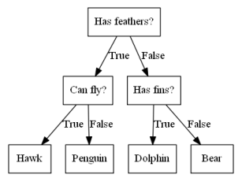
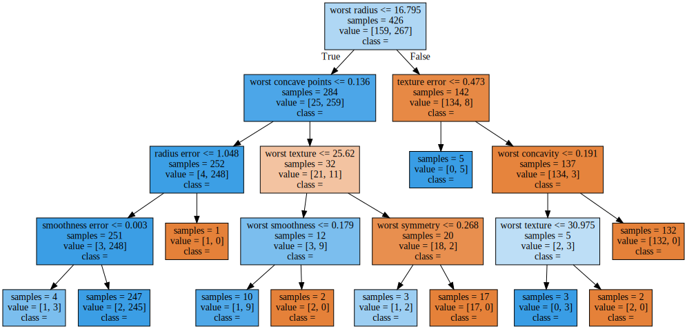
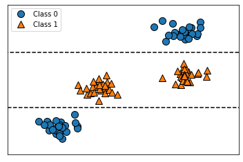
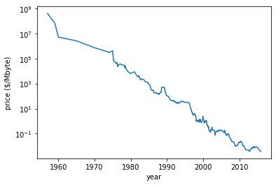

```python
import mglearn
import graphviz
import pandas as pd
import numpy as np
import os
from matplotlib import pyplot as plt
from sklearn.datasets import load_breast_cancer
from sklearn.tree import DecisionTreeClassifier
from sklearn.tree import DecisionTreeRegressor
from sklearn.linear_model import LinearRegression
from sklearn.model_selection import train_test_split
```

---

#### <u>결정 트리(Decision Tree)</u>

- `분류`와 `회귀` 문제에 널리 사용하는 모델
- 기본적으로 결정에 다다르기 위해 `예/아니오` 질문을 이어 나가며 학습한다.(스무고개와 유사)


```python
mglearn.plots.plot_animal_tree()
```


    

    


위 그림에서 
- 트리의 `노드` : 질문이나 정답을 담은 네모 상자, 마지막 노드의 경우 `리프(leaf)`라 한다.
- 트리의 `엣지` : 질문의 답과 다음 질문을 연결

<br>

쉽게 말하자면 위의 질문들을 이용해 네 개의 클래스를 구분하는 모델을 만든 것이다.<br>
이런 모델을 직접 만드는 대신 `지도 학습 방식`으로 데이터로부터 학습할 수 있다.

---

#### <u> 결정 트리 만들기</u>

`결정 트리`를 학습한다는 것은 <u>정답에 가장 빨리 도달하는 예/아니오</u> 질문 목록을 학습한다는 의미이다.<br>머신러닝에서는 이런 질문들을 `테스트`라고 한다.

<br>

보통 데이터는 앞서의 동물 구분 예제와 같이 예/아니오 형태의 특성으로 구성되지 않고,<br> 다음의 데이터와 
같이 `연속된 특성`으로 구성된다.<br>


<br>

`연속적인 데이터`에 적용할 `테스트`는 <u><b>특성 i는 값 a보다 큰가?</b></u>와 같은 형태를 보인다.

<br>

트리를 만들 때의 알고리즘은 가능한 모든 `테스트`에서<br>타겟 값에 대하여 가장 많은 정보를 가진 것을 고른다.<br>즉, <u>모든 테스트(질문)에서 데이터를 가장 잘 나누는 테스트(질문)을 찾는 것</u>이다.

<br>

아래의 그림은 첫 번째로 선택된 `테스트`를 보여준다.<br>
데이터셋을 x[1] = 0.06에서 수평으로 나누는 것이 가장 많은 정보를 포함한다.<br>
즉 이 직선이 class 0와 class 1의 포인트를 가장 잘 나누는 것이다.

<br>


<br>

`루트 노트(root node)`라 불리는 맨 위의 노드는<br>class 0에 속한 포인트 50개와 class 1에 속한 포인트 50개를 모두 포함한 전체 데이터셋을 나타낸다.

<br>

첫 번째 분류가 두 class를 완벽하게 분류하지 못해서<br>
아래 영역에는 아직 class 0에 속한 포인트가 들어 있고, 위 영역에는 class 1에 속한 포인트가 포함되어 있다.

<br>

이 두 영역에서 가장 좋은 `테스트`를 찾는 과정을 <b>반복</b>해서 모델을 더 정확하게 만들 수 있다.

<br>


<br>

반복된 프로세스는 각 `노드(네모상자)`가 `테스트(질문)` 하나씩을 가진 `결정 트리`를 만든다.<br>
이는 계층적으로 영역을 분할해가는 알고리즘이라고 할 수 있다.<br>
각 `테스트`는 하나의 특성에 대해서만 이루어지므로 <u>나누어진 영역은 항상 축에 평행하다.</u>

<br>

데이터를 분할하는 과정은 분할된 하나의 영역이 한 개의 타깃값을 가질 때까지 반복된다.<br>
이때, <u>타깃 하나로만 이뤄진 리프노드</u>를 `순수 노드(pure node)`라고 한다.

<br>

<u>새로운 데이터 포인트에 대한 예측</u>은<br>
주어진 데이터 포인트가 특성을 분할한 영역들 중 어디에 놓이는지를 확인하면 된다. 


같은 방법으로 `회귀 문제`에도 트리를 사용 가능하다.<br>
예측을 하려면 각 노드의 테스트 결과에 따라 트리를 탐색해나가고<br> 
새로운 데이터 포인트에 해당되는 리프 노드를 찾는다.<br>


<u>찾은 리프 노드의 훈련 데이터 `평균 값`이 이 데이터 포인트의 출력</u>이 된다.

---

#### <u>결정 트리의 복잡도 제어하기</u>

일반적으로 <b>모든</b> `리프 노드`가 `순수 노드`가 될 때까지 진행된다면
- 모델이 매우 복잡해진다.
- 훈련 데이터에 과대적합된다.<br>즉 `순수 노드`로만 이루어진 트리는 `훈련 세트`에 100%정확하게 맞는다는 의미이다.

<br>

아래의 그래프에서 `결정트리`과정에서 `과대적합`의 예시이다. class 0으로 결정된 영역이 class 1에 속한 포인트들로 둘러쌓인 것을 볼 수 있다. 그 반대 모습도 보인다. 이는 바람직한 결정 경계가 아니다.


`과대적합`을 막는 전략은 크게 두 가지이다.
- `사전 가지치기(pre_pruning)` 
    - 트리 생성을 일찍 중단
    - 트리의 최대 깊이를 제한
    - 분할하기 위한 포인트의 최소 개수를 지정
    
    <br>
    
- `사후 가지치기(post-pruning)`
    - 트리를 만든 후 포인트가 적은 노드를 삭제하거나 병합시키는 전략

<br>

`scikit-learn`에서 `결정 트리`는 `DecisionTreeRegressor`와 `DecisionTreeClassifier`에 구현되어있다.<br>
하지만, `scikit-learn`에서는 `사전 가지치기`만을 지원한다.

<br>

`유방암 데이터셋`을 이용해서 `사전 가지치기`의 효과를 확인해보자<br>
기본값 설정으로 완전한 트리(모든 리프 노드가 순수 노드가 될 때까지 생성한 트리) 모델을 만들고,<br>
random_state 옵션을 고정해 만들어진 트리를 같은 조건으로 비교할 것이다.


```python
cancer = load_breast_cancer()
X_train, X_test, y_train, y_test = train_test_split(
    cancer.data, cancer.target, stratify=cancer.target, random_state=42)

tree = DecisionTreeClassifier(random_state=0)
tree.fit(X_train, y_train)

print("훈련 세트 정확도: {:.3f}".format(tree.score(X_train, y_train)))
print("테스트 세트 정확도: {:.3f}".format(tree.score(X_test, y_test)))
```

    훈련 세트 정확도: 1.000
    테스트 세트 정확도: 0.937
    

모든 `리프 노드`가 `순수 노드`이므로 `훈련 세트`의 정확도는 100%이다.<br>
즉 트리는 `훈련 세트`의 모든 레이블을 완벽하게 기억할 만큼 완벽하게 만들어졌다.<br>

<br>

결정 트리의 깊이를 제한하지 않으면 트리는 무한정 깊어지고 복잡해진다.<br>
그래서 가지치기하지 않은 트리는 `과대적합`되기 쉽고 새로운 데이터에 잘 일반화되지 않는다.

<br>

이제 `사전 가지치기`를 트리에 적용해서 `훈련 세트`에 완전히 학습되기 전에 트리의 성장을 막아보자<br>
`max_depth=4` 옵션을 주면 연속된 질문을 최대 4개로 제한한다.(즉 4번의 단계가 시행된다는 의미)<br>
트리의 깊이를 제한하면 `훈련 세트`의 정확도를 떨어뜨리지만,<br>
`과대적합`이 줄어들며, `테스트 세트`의 성능을 개선시킨다.


```python
tree = DecisionTreeClassifier(max_depth=4, random_state=0)
tree.fit(X_train, y_train)

print("훈련 세트 정확도: {:.3f}".format(tree.score(X_train, y_train)))
print("테스트 세트 정확도: {:.3f}".format(tree.score(X_test, y_test)))
```

    훈련 세트 정확도: 0.988
    테스트 세트 정확도: 0.951
    

---

#### 결정 트리 분석

트리 모듈의 `export_graphviz` 함수를 이용해 트리를 시각화할 수 있다.<br>
이 함수는 그래프 저장용 텍스트 파일 포맷인 `.dot`파일을 만든다.<br>
각 노드에서 다수인 클래스를 색으로 나타내기 위해 옵션을 주고<br> 적절히 레이블되록 클래스 이름과 특성 이름을 매개변수로 전달한다.


```python
from sklearn.tree import export_graphviz
export_graphviz(tree, out_file="tree2.dot", class_names=["악성", "양성"],
                feature_names=cancer.feature_names,
                impurity=False, filled=True)
```


```python
with open("tree.dot", encoding='UTF-8') as f:
    dot_graph = f.read()
display(graphviz.Source(dot_graph))
```


    

    


그러나 여기서 보듯이 깊이가 4만 되어도 트리는 매우 장황해진다.<br>
트리가 더 깊어지면(10 정도의 깊이는 보통입니다) 한눈에 보기가 힘들어진다.<br>
트리를 조사할 때는 많은 수의 데이터가 흐르는 경로를 찾아보면 좋다. 

<br>

대부분의 양성 샘플은 왼쪽에서 두 번째 노드에 할당되고<br>나머지 `리프 노드` 대부분은 매우 적은 양의 샘플만 가지고 있다.

---

#### <u>트리의 특성 중요도</u>

전체 트리를 살펴보는 것은 어려울 수 있으므로,<br>
대신 트리가 <u>어떻게 작동하는지 요약하는 속성</u>들을 사용할 수 있다.

<br>

가장 널리 사용되는 속성은 트리를 만드는 결정에<br>
<u>각 특성이 얼마나 중요한지를 평가</u>하는 `특성 중요도(feature importance)`가 있다<br>
이 값은 0과 1사이의 숫자이다.

- `0` : 전혀 사용되지 않았다는 의미
- `1` : 완벽하게 타깃 클래스를 예측했다는 의미
- `특성 중요도`의 전체 합은 1이다.


```python
print("특성 중요도:\n{}".format(tree.feature_importances_))
```

    특성 중요도:
    [0.         0.         0.         0.         0.         0.
     0.         0.         0.         0.         0.01019737 0.04839825
     0.         0.         0.0024156  0.         0.         0.
     0.         0.         0.72682851 0.0458159  0.         0.
     0.0141577  0.         0.018188   0.1221132  0.01188548 0.        ]
    

선형 모델의 계수를 시각화하는 것과 비슷한 방법으로 `특성 중요도`도 시각화할 수 있다.


```python
def plot_feature_importances_cancer(model):
    n_features = cancer.data.shape[1]
    plt.barh(range(n_features), model.feature_importances_, align='center')
    plt.yticks(np.arange(n_features), cancer.feature_names)
    plt.xlabel("feature_importances")
    plt.ylabel("property")
    plt.ylim(-1, n_features)

plot_feature_importances_cancer(tree)
```


    

    


첫 번째 노드에서 사용한 특성(`“worst radius”`)이 가장 중요한 특성으로 나타낸다.<br>
이 그래프는 첫 번째 노드에서 두 클래스를 꽤 잘 나누고 있다는 것을 의미해주고 있다.

<br>

그러나 어떤 특성의 `feature_importance_` 값이 낮다고 해서<br>
이 특성이 유용하지 않다는 뜻이 아니다.<br>
<u>단지 트리가 그 특성을 선택하지 않았을 뿐</u>이며 다른 특성이 동일한 정보를 지니고 있어서일 수 있습니다.

<br>

또한, `선형 모델`의 `계수`와 달리,<br>
`특성 중요도`는 항상 <b>양수</b>이며 특성이 어떤 클래스를 지지하는지 알 수 없다.<br>
즉 위에서는 `worst radius`가 중요하다고 하지만,<br>
높은 반지름이 양성을 의미하는지 악성을 의미하는지 알 수 없다.<br>
이는 `특성`과 `클래스`사이에 간단한 관계가 없을 수 있음을 의미한다.


```python
tree = mglearn.plots.plot_tree_not_monotone()
display(tree)
```

    Feature importances: [0. 1.]
    


    

    


    

    


아래의 그림은 `y축 특성`이 `클래스 레이블`과 복합적인 관계를 가지고 있는<br>
결정 트리가 만든 2차원 데이터셋에서의 `결정 경계`이다.<br>
그리고 위의 그림은 아래의 그림에 나타난 데이터로 학습한 `결정 트리`이다.

<br>

여기서도 `worst radius`처럼 `x[1]`과 출력 클래스와의 관계는 단순한 관계가 나타나 있지 않음을 보인다.<br>
즉 “X[1] 값이 높으면 클래스 0이고 값이 낮으면 1”이라고(또는 그 반대로) 말할 수 없다는 것이다.

<br>

---

#### <u>회귀 결정 트리(DecisionTreeRegression)</u>

`DecisionTreeRegression`로 구현된 `회귀 결정 트리`에서도<br>
`결정 트리(DecisionTreeClassifiaction)`와 비슷하게 적용된다.<br>
하지만 `회귀`를 위한 `트리`를 사용하고 싶을 때는 짚고 가야할 한가지의 특별한 속성이 있다.

<br>

<b>(Point!!)</b><br>
`DecisionTreeRegressor`(그리고 모든 다른 트리 기반 회귀 모델)는<br>
`외삽(extrapolation)`, 즉 <u>훈련 데이터의 범위 밖의 포인트에 대해 예측을 할 수 없습니다.</u><br>
다음의 컴퓨터 메모리 가격 동향 데이터셋을 이용해 확인해보자.


```python
ram_prices = pd.read_csv(os.path.join(mglearn.datasets.DATA_PATH, "ram_price.csv"))

plt.semilogy(ram_prices.date, ram_prices.price)
plt.xlabel("year")
plt.ylabel("price ($/Mbyte)")
```


    Text(0, 0.5, 'price ($/Mbyte)')


    

    


`y` 축은 `로그 스케일`이다.<br>
그래프를 `로그 스케일`로 그리면 약간의 굴곡을 제외하고는<br>
<u>선형적으로 나타나서 비교적 예측하기가 쉬워진다.</u>

<br>

날짜 특성 하나만으로 2000년 전까지의 데이터로 부터 2000년 후의 가격을 예측해보자.<br>
여기서는 두 모델 `DecisionTreeRegressor`와 `LinearRegression`을 비교하면서 볼 것이다.


```python
# 2000년 이전을 훈련 데이터로, 2000년 이후를 테스트 데이터로 만듭니다.
data_train = ram_prices[ram_prices.date < 2000] 
data_test = ram_prices[ram_prices.date >= 2000]

# 가격 예측을 위해 날짜 특성만을 이용합니다.
X_train = np.array(data_train['date']).reshape(-1,1)
# 데이터와 타깃의 관계를 간단하게 만들기 위해 로그 스케일로 바꿉니다.
y_train = np.log(data_train.price)

tree = DecisionTreeRegressor().fit(X_train, y_train)
linear_reg = LinearRegression().fit(X_train, y_train)

# 예측은 전체 기간에 대해서 수행합니다.
X_all = np.array(ram_prices['date']).reshape(-1,1)

pred_tree = tree.predict(X_all)
pred_lr = linear_reg.predict(X_all)

# 예측한 값의 로그 스케일을 되돌립니다.
price_tree = np.exp(pred_tree)
price_lr = np.exp(pred_lr)
```


```python
plt.figure(figsize=(15, 10))

plt.subplot(2,2,1)
plt.semilogy(data_train.date, data_train.price, label="Train Data")
plt.legend()

plt.subplot(2,2,2)
plt.semilogy(data_test.date, data_test.price, label="Test Data")
plt.legend()

plt.subplot(2,2,3)
plt.semilogy(ram_prices.date, price_tree, label="Tree Regression Predict")
plt.legend()

plt.subplot(2,2,4)
plt.semilogy(ram_prices.date, price_lr, label="Linear Regression Predict")
plt.legend()
```


    <matplotlib.legend.Legend at 0x25ce0718d90>


    

    


```python
plt.semilogy(data_train.date, data_train.price, label="Train Data")
plt.semilogy(data_test.date, data_test.price, label="Test Data")
plt.semilogy(ram_prices.date, price_tree, label="Tree Regression Predict")
plt.semilogy(ram_prices.date, price_lr, label="Linear Regression Predict")
plt.legend()
```


    <matplotlib.legend.Legend at 0x25ce0419e50>


    

    


두 모델은 확연한 차이를 보인다.
- `선형 모델`
    - 직선으로 데이터가 근사하였다.
    - 직선은 `훈련 데이터`와 `테스트 데이터`에 있는 미세한 굴곡을 매끈하게 근사하여<br>2000년 이후의 `테스트 데이터`를 꽤 정확하게 예측했다.
    
<br>

- `트리 모델`
    - 복잡도에 제한을 두지 않았기 때문에 `훈련 데이터`를 완벽하게 예측한다.
    - 모델이 가진 데이터 범위 밖(2000년 이후)으로 나가면 단순히 마지막 포인트를 이용해 예측해버린다.
    - `트리 모델`은 `훈련 데이터` 밖의 <u>새로운 데이터를 예측할 능력이 없다.</u>

---

#### <u>장단점과 매개변수</u>

`결정 트리`에서 모델 복잡도를 조절하는 매개변수로는 `사전 가지치기` 매개변수가 있다.
- `max_depth`, `max_leaf_nodes` 또는 `min_samples_leaf`을 이용해 `과대적합`을 막음
    
<br>

`결정 트리`가 이전에 소개한 다른 알고리즘들보다 나은 점은 두 가지입니다
- <b>장점</b>
    - 만들어진 모델을 쉽게 시각화할 수 있고, 비전문가도 이해하기 쉽다.
    - 데이터의 스케일에 구애받지 않는다.
    - 각 특성이 개별적으로 처리되어있어 특성의 스케일이 달라도<br>특성의 정규화나 표준화같은 전처리 과정이 필요없다.
    - 특히 특성의 스케일이 서로 다르거나, 이진 특성과 같은 연속적인 특성이 혼합되어 있을 때도 잘 작동한다.
    
<br>

- <b>단점</b>
    - `사전 가지치기`를 사용함에도 불구하고 `과대적합`되는 경향이 있어<br>일반화 성능이 좋지 않다.

---

### References

- 안드레아스 뮐러, 세라 가이도, 『파이썬 라이브러리를 활용한 머신러닝』, 박해선, 한빛미디어(2017)
- https://tensorflow.blog/%ed%8c%8c%ec%9d%b4%ec%8d%ac-%eb%a8%b8%ec%8b%a0%eb%9f%ac%eb%8b%9d/2-3-3-%ec%84%a0%ed%98%95-%eb%aa%a8%eb%8d%b8/
- https://kolikim.tistory.com/9
